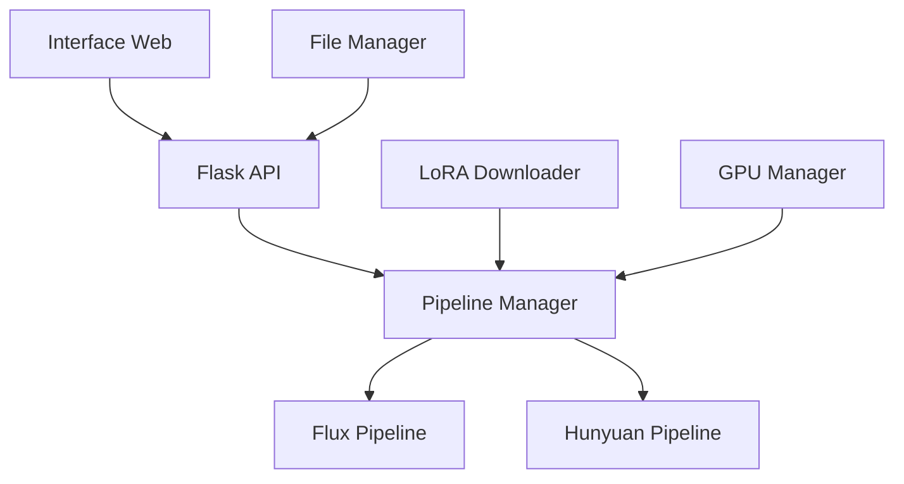

# webinterface-imageai# webinterface-imageai

# 🎨 Générateur d'Images IA

Une application complète pour générer des images avec vos modèles Flux et Hunyuan personnalisés, avec support des LoRAs et interface web intuitive.


## ✨ Fonctionnalités

- 🔥 **Support Flux et Hunyuan** : Compatible avec vos modèles safetensors
- 🎯 **LoRAs dynamiques** : Ajout de LoRAs via URL pour personnaliser le style
- 🖥️ **Interface web moderne** : Drag & drop, preview en temps réel
- 📐 **Formats multiples** : 1:1, 4:3, 3:4, 16:9, 9:16 et plus
- 🚀 **Déploiement facile** : Local, Docker, ou Render
- 🧹 **Gestion automatique** : Nettoyage des fichiers temporaires
- ⚡ **Optimisé GPU/CPU** : Détection automatique CUDA

## 🚀 Installation Rapide

### Méthode 1: Installation locale

```bash
# Cloner le projet
git clone <votre-repo>
cd ai-image-generator

# Installation automatique
make install
# ou manuellement:
chmod +x setup_local.sh && ./setup_local.sh

# Démarrer l'application
make run
# ou manuellement:
source venv/bin/activate && python app.py
```

### Méthode 2: Docker

```bash
# Construction et lancement
make docker
# ou manuellement:
docker build -t ai-image-generator .
docker-compose up -d

# L'application sera disponible sur http://localhost:5000
```

### Méthode 3: Déploiement sur Render

1. Forkez ce repository
2. Connectez votre compte Render à GitHub
3. Créez un nouveau service Web
4. Sélectionnez ce repository
5. Render utilisera automatiquement `render.yaml`

## 📋 Prérequis

### Système minimum
- **Python** 3.10+
- **RAM** 8GB (16GB+ recommandé)
- **Stockage** 20GB+ (pour les modèles)
- **GPU** Optionnel mais recommandé (CUDA 11.8+)

### Dépendances Python
- Flask 3.0+
- PyTorch 2.1+
- Diffusers 0.25+
- Safetensors 0.4+
- Pillow, requests, numpy

Voir `requirements.txt` pour la liste complète.

## 🎯 Utilisation

### 1. Préparer vos modèles

Placez vos fichiers `.safetensors` dans le dossier `models/` :

```
models/
├── mon_modele_flux.safetensors
├── mon_modele_hunyuan.safetensors
└── loras/
    ├── style_anime.safetensors
    └── style_realistic.safetensors
```

### 2. Interface Web

1. Ouvrez http://localhost:5000
2. **Upload** votre modèle safetensors
3. **Sélectionnez** le type (Flux/Hunyuan)
4. **Ajoutez** des URLs de LoRAs (optionnel)
5. **Configurez** les paramètres :
   - Dimensions (1:1, 4:3, 16:9, etc.)
   - Nombre d'images (1-4)
   - Steps, Guidance Scale
6. **Saisissez** votre prompt
7. **Cliquez** sur "Générer"

### 3. API REST

```bash
# Status de l'application
curl http://localhost:5000/api/status

# Génération d'image
curl -X POST http://localhost:5000/api/generate \
  -F "model_file=@mon_modele.safetensors" \
  -F "model_type=flux" \
  -F "prompt=a beautiful landscape" \
  -F "image_count=2" \
  -F "dimensions=768x512"

# Nettoyage des fichiers temporaires
curl -X POST http://localhost:5000/api/cleanup
```

## ⚙️ Configuration

### Variables d'environnement

```bash
# Développement
FLASK_DEBUG=true
FLASK_ENV=development
HOST=127.0.0.1
PORT=5000

# Production
FLASK_ENV=production
FLASK_DEBUG=false
PYTORCH_CUDA_ALLOC_CONF=max_split_size_mb:512
TOKENIZERS_PARALLELISM=false
```

### Configuration GPU

```python
# Automatiquement détecté
device = "cuda" if torch.cuda.is_available() else "cpu"

# Gestion mémoire GPU
torch.cuda.empty_cache()  # Libération mémoire
```

## 🔧 API Endpoints

| Endpoint | Méthode | Description |
|----------|---------|-------------|
| `/` | GET | Page d'accueil |
| `/api/status` | GET | Status de l'application |
| `/api/generate` | POST | Génération d'images |
| `/api/image/<filename>` | GET | Servir les images générées |
| `/api/cleanup` | POST | Nettoyage fichiers temporaires |

### Paramètres de génération

```javascript
{
  "model_file": "fichier .safetensors",
  "model_type": "flux|hunyuan", 
  "prompt": "description de l'image",
  "lora_urls": "URLs des LoRAs (optionnel)",
  "image_count": 1-4,
  "dimensions": "512x512|768x432|etc",
  "steps": 20-100,
  "guidance": 1.0-20.0,
  "output_dir": "dossier de destination"
}
```

## 🐳 Docker

### Dockerfile optimisé

```dockerfile
FROM nvidia/cuda:11.8-devel-ubuntu22.04
# Support GPU + optimisations mémoire
# Multi-stage build pour réduire la taille
```

### Docker Compose

```yaml
version: '3.8'
services:
  ai-generator:
    build: .
    ports: ["5000:5000"]
    volumes:
      - ./models:/app/models
      - ./generated_images:/app/generated_images
    deploy:
      resources:
        reservations:
          devices: [driver: nvidia, count: 1]
```

## ☁️ Déploiement sur Render

### Configuration automatique

Le fichier `render.yaml` configure automatiquement :

- **Service Web** avec Gunicorn
- **Stockage persistant** pour les modèles (50GB)
- **Variables d'environnement** optimisées
- **Health checks** automatiques
- **Auto-scaling** selon la charge

### Limitations Render

- ⚠️ **CPU uniquement** (pas de GPU sur plans standards)
- ⏱️ **Timeout 30s** pour les requêtes HTTP
- 💾 **Mémoire limitée** selon le plan choisi
- 📦 **Build time** limité à 15 minutes

### Optimisations pour Render

```python
# Modèles optimisés CPU
pipeline = FluxPipeline.from_pretrained(
    model_path,
    torch_dtype=torch.float32,  # CPU
    device_map=None
)

# Steps réduits pour performance
default_steps = 20  # Au lieu de 50+
```

## 🧪 Tests et Monitoring

### Tests automatiques

```bash
# Tests complets
make test

# Monitoring en continu
make monitor

# Tests spécifiques
./monitor.sh http://localhost:5000
```

### Métriques surveillées

- ✅ Status de l'API
- 🔥 Utilisation GPU/CPU
- 💾 Mémoire disponible
- 📊 Temps de génération
- 🗂️ Fichiers temporaires

## 🛠️ Dépannage

### Problèmes courants

#### "CUDA out of memory"
```bash
# Réduire la taille d'image
dimensions = "512x512"  # Au lieu de 1024x1024

# Réduire le nombre d'images
image_count = 1

# Vider le cache
torch.cuda.empty_cache()
```

#### "Module not found"
```bash
# Réinstaller les dépendances
pip install -r requirements.txt

# Vérifier l'environnement virtuel
source venv/bin/activate
```

#### "Safetensors invalid"
```bash
# Vérifier le fichier
python -c "import safetensors.torch as st; st.load_file('model.safetensors')"

# Télécharger à nouveau
wget <url_modele> -O model.safetensors
```

### Logs de debug

```bash
# Activer le debug
export FLASK_DEBUG=true

# Logs détaillés
python app.py 2>&1 | tee app.log
```

## 📚 Documentation Avancée

### Structure du projet

```
ai-image-generator/
├── app.py                 # Application Flask principale
├── requirements.txt       # Dépendances Python
├── render.yaml           # Configuration Render
├── Dockerfile            # Image Docker
├── docker-compose.yml    # Orchestration Docker
├── Makefile             # Automatisation des tâches
├── README.md            # Cette documentation
├── web/
│   └── index.html       # Interface web
├── scripts/
│   ├── setup_local.sh   # Installation locale
│   ├── deploy_render.sh # Déploiement Render
│   └── monitor.sh       # Monitoring
├── models/              # Modèles safetensors
├── generated_images/    # Images générées
└── temp/               # Fichiers temporaires
```

### Architecture technique



### Personnalisation

#### Ajouter un nouveau type de modèle

```python
def load_custom_pipeline(self, model_path, lora_paths):
    """Support pour un nouveau type de modèle"""
    pipeline = CustomPipeline.from_pretrained(model_path)
    # Logique spécifique...
    return pipeline
```

#### Modifier l'interface

```javascript
// web/index.html
// Personnaliser les styles, ajouter des fonctionnalités
```

## 🤝 Contribution

1. **Fork** le projet
2. **Créez** une branche feature (`git checkout -b feature/amazing-feature`)
3. **Committez** vos changements (`git commit -m 'Add amazing feature'`)
4. **Poussez** vers la branche (`git push origin feature/amazing-feature`)
5. **Ouvrez** une Pull Request

### Guidelines

- Code en anglais, commentaires en français acceptés
- Tests unitaires requis pour les nouvelles fonctionnalités
- Documentation mise à jour
- Style PEP 8 pour Python

## 📄 Licence

Ce projet est sous licence MIT. Voir le fichier `LICENSE` pour plus de détails.

## 🆘 Support

- 📖 **Documentation** : Ce README
- 🐛 **Issues** : GitHub Issues
- 💬 **Discussions** : GitHub Discussions
- 📧 **Contact** : votre@email.com

---

**Fait avec ❤️ et beaucoup de ☕**

⭐ N'oubliez pas de star le repo si ce projet vous aide !
